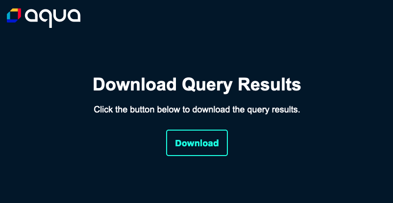

# Iris: Metrics collector for Aqua

**Iris** is a metrics gathering tool necessary for assessing risk and security posture as seen by the Aqua Platform. Iris runs alongside Aqua componets in an on-premises deployment and collects useful metrics directly from the database.

## Quick Start

### Run inside a Kubernetes cluster

The primary use case is to run Iris within an existing `aqua` namespace in a Kubernetes Cluster.  For this, there's a [Kubernetes Deployment YAML](https://raw.githubusercontent.com/kenmccann/aqua-iris/main/aqua-iris-deploy.yaml) you can use for a quick deployment of the `aqua-iris` pod into the aqua namespace.

#### Pre-requisites

- The target namespace for the Aqua components must be named `aqua`
- The namespace must contain a `ConfigMap` object named `aqua-csp-server-config` containing the database connection secrets
- A Kubernetes secret defined in the aqua namespace called `aqua-db`

If any of these are missing or configured differently, please download the [Kubernetes Deployment YAML](https://raw.githubusercontent.com/kenmccann/aqua-iris/main/aqua-iris-deploy.yaml) and make changes to the deployment accordingly.

##### Deploy Iris as a container to the aqua namespace:

``` bash
kubectl create -f https://raw.githubusercontent.com/kenmccann/aqua-iris/main/aqua-iris-deploy.yaml
```

### Run with Docker

It is recommended to run Iris as a container, due to the application environment requirements and dependencies. 

#### Build the Docker image from source

```
docker build . -t aqua-iris:latest
```

#### Run the Docker container

```
docker run --rm -it --entrypoint=/bin/sh \
-e SCALOCK_DBPASSWORD=<password> \
-e SCALOCK_DBHOST=<hostname> \
-e SCALOCK_DBNAME=<database_name> \
-e SCALOCK_DBUSER=<database_user> \
aqua-iris:latest
```

## Collecting the Results

All data gathered by the queries is stored inside the container, but can be exported by connecting to the http server which is run as part of the default `--daemon` mode.  The easiest way to retrieve this data is to connect to the container's port with a web-browser.  The default port is `8088`.

The query results are also output to console, but only for visual confirmation and review.  Tables larger than 50 rows are not output to the console/logs.

### Port-forward with Kubernetes

From your workstation's command console, you can forward the application's listening port via kubectl to a local port on your workstation.

```
kubectl port-forward deployment/aqua-iris 8088:8088 -n aqua
```

You'll be presented with a simple web interface containing a button that initiates the download of all the query data.

